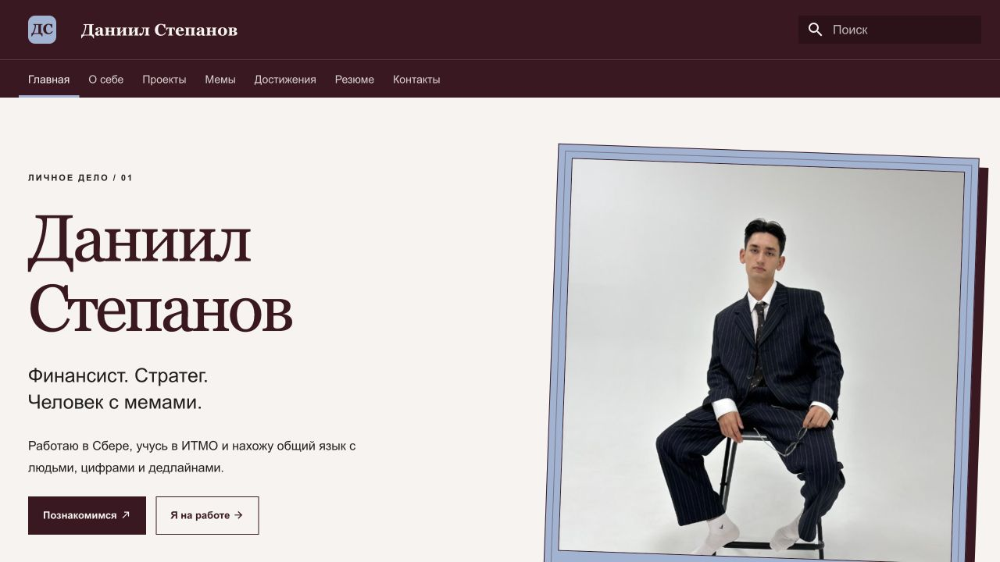
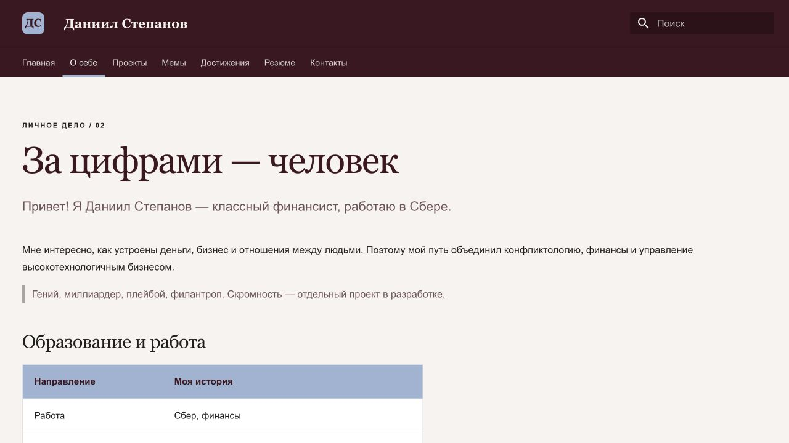
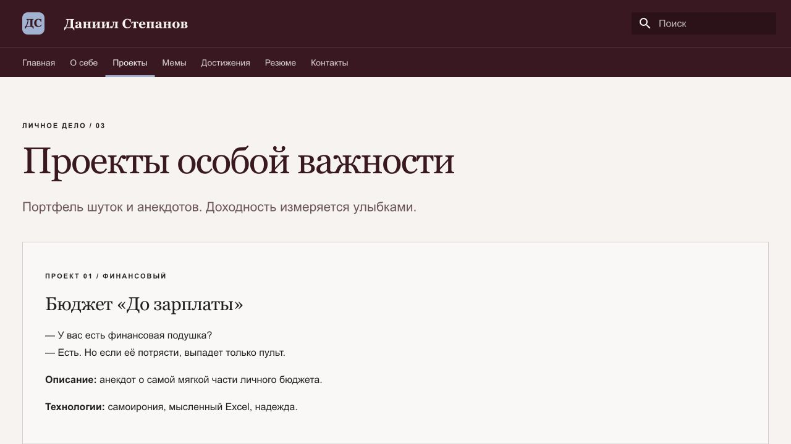
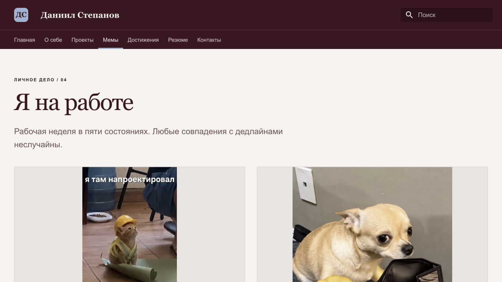
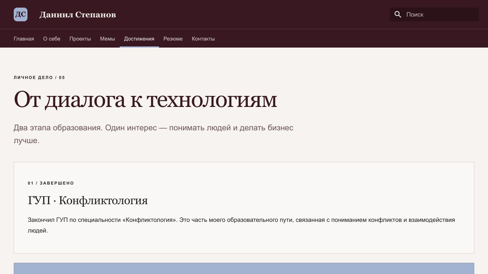
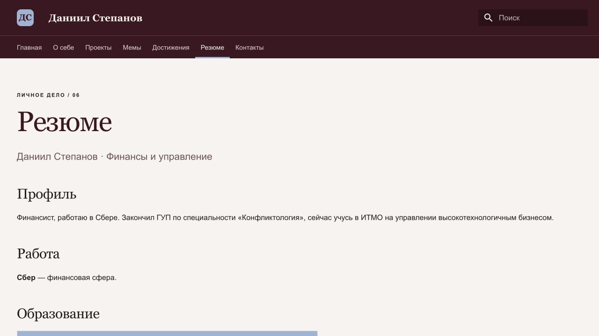
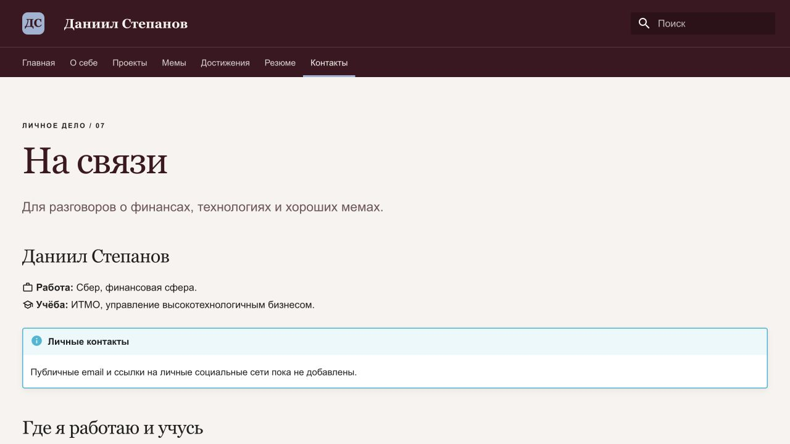
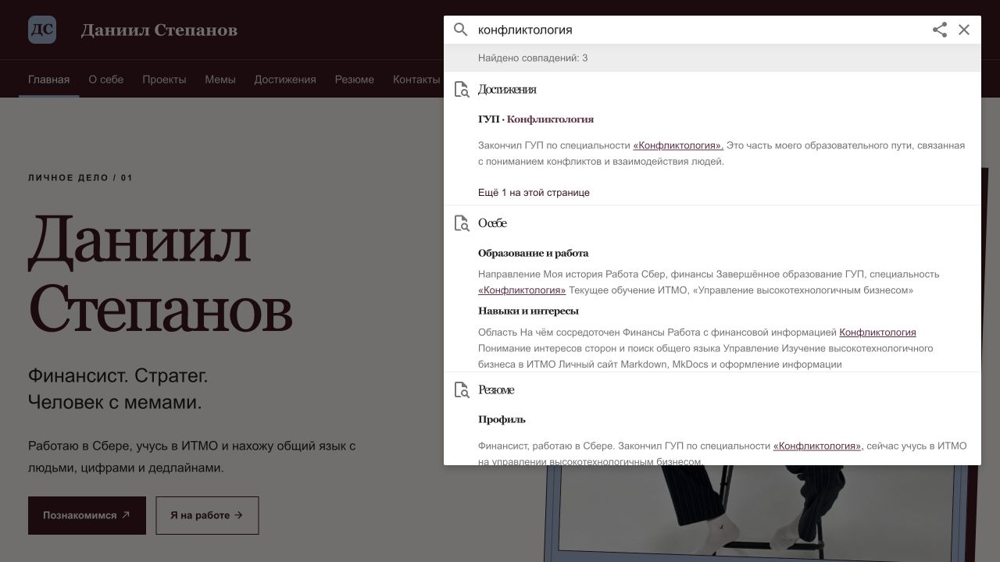
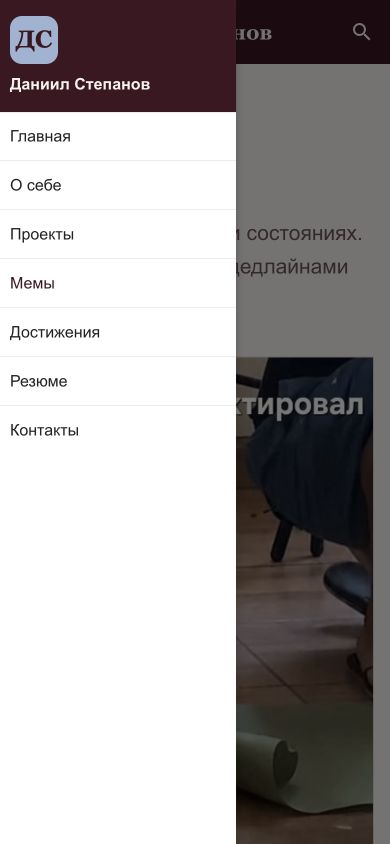

# Создание персонального сайта с использованием MkDocs

**[Открыть сайт курсовой](https://dasestepanov.github.io/devops-lab-stepanov/)**

**Автор:** Степанов Даниил.  
**Формат результата:** работающий статический сайт с исходниками.  
**Технологии:** Python, MkDocs 1.6.1, Material 9.7.7, Markdown, CSS и SVG.

## Цель

Создать персональный сайт и освоить структурирование информации в Markdown, настройку MkDocs, оформление страниц и сборку статических файлов.

## Концепция

Сайт представляет Даниила Степанова — финансиста, работающего в Сбере, выпускника ГУП по специальности «Конфликтология» и текущего студента ИТМО по направлению «Управление высокотехнологичным бизнесом». Деловое оформление сочетается с юмористической самопрезентацией. Раздел проектов по авторскому запросу содержит шутки и анекдоты вместо описаний реальных программных проектов.

## Реализация

1. Создана отдельная папка проекта и виртуальное окружение Python. Установлены MkDocs и Material; зависимости зафиксированы в `requirements.txt`.
2. Подготовлен `mkdocs.yml`: название, описание, автор, язык, Material, навигационные вкладки, поиск и футер.
3. Созданы страницы «Главная», «О себе», «Проекты», «Мемы», «Достижения», «Резюме», «Контакты».
4. В `docs/images/` помещены предоставленный портрет и пять мемов. Создан векторный логотип с инициалами «ДС».
5. В CSS реализованы цвета `#9DB3D3` и `#3F1521`, двойная рамка портрета с тенью, карточки, сетка мемов и адаптация к узкому экрану.
6. Выполнены строгая сборка, проверка внутренних ссылок и просмотр в браузере.

## Использование Markdown

| Элемент | Где реализован |
| --- | --- |
| Заголовки разных уровней | Главная, О себе, Резюме |
| Маркированные и нумерованные списки | Главная |
| Таблицы | О себе, Достижения, Резюме |
| Цитаты | Главная, О себе, Проекты |
| Внутренние и внешние ссылки | Все страницы, Контакты |
| Изображения | Главная, Мемы |
| Карточки и блоки | Главная, Проекты, Достижения |
| Иконки | Кнопки на главной, Контакты |

Основной текст написан на Markdown. Для композиции фотографии и галереи использованы HTML-контейнеры с CSS; расширение `md_in_html` позволяет размещать Markdown внутри контейнеров.

## Проверка

- `mkdocs build --strict` — успешно, без ошибок конфигурации и ссылок.
- Созданы семь содержательных HTML-страниц и служебная страница 404.
- Проверены локальные ссылки, изображения и якоря в готовой сборке: отсутствующих целей нет.
- Поисковый индекс содержит 34 записи; поиск «конфликтология» в браузере возвращает три страницы.
- Главная просмотрена на широком экране; мемы и раскрытие меню проверены при ширине 390 пикселей.
- Статическая версия сохранена в `site/`, исходники — в `docs/`.

## Скриншоты сайта

Снимки сделаны в браузере при локальном запуске сайта. Рисунки 1–8 показывают видимую область страницы на компьютере, рисунок 9 — мобильное меню.

### Рисунок 1. Главная страница

Приветственный экран, фото автора в рамке и навигация по сайту.

### Рисунок 2. О себе

Самопрезентация автора и таблица с информацией об образовании и работе.

### Рисунок 3. Проекты

Юмористические проекты, оформленные отдельными карточками.

### Рисунок 4. Мемы

Раздел «Я на работе» с изображениями и авторскими подписями.

### Рисунок 5. Достижения

Страница образовательного пути: ГУП и ИТМО.

### Рисунок 6. Резюме

Краткая профессиональная информация и сведения об образовании.

### Рисунок 7. Контакты

Контактный раздел со ссылками на организации.

### Рисунок 8. Поиск по сайту

Результаты запроса «конфликтология»: найдены три страницы.

### Рисунок 9. Мобильная навигация

Раскрытое меню при ширине экрана 390 пикселей.

## Особенности сдаваемой версии

Личные email и социальные сети не предоставлены, поэтому не выдуманы. На странице контактов размещено уведомление и официальные ссылки организаций. Сайт опубликован на GitHub Pages, адрес указан в `site_url`.

## Вывод

Создан персональный сайт на MkDocs Material с семью страницами, навигацией, поиском и индивидуальным оформлением. Работа демонстрирует разметку Markdown, настройку генератора статических сайтов и разделение содержания и оформления.

## Источники

1. [Официальная документация MkDocs](https://www.mkdocs.org/).
2. [Material for MkDocs](https://squidfunk.github.io/mkdocs-material/).
3. [Markdown Guide](https://www.markdownguide.org/).
4. Фотография, мемы и цветовой референс предоставлены автором задания.
