University: [ITMO University](https://itmo.ru/ru/)

Faculty: [FICT](https://fict.itmo.ru)

Course: [Введение в веб технологии](https://ex-itmo-ict-faculty.github.io/introduction-in-web-tech/)

Year: 2026/2027

Group: U4225

Author: Степанов Даниил Сергеевич

Lab: Lab3

Date of create: 12.09.2026

Date of finished: — (заполняется после защиты)

# Лабораторная работа №3. Мониторинг и тестирование безопасности веб-приложения

## Цель работы

Настроить локальную систему мониторинга с Prometheus, Node Exporter и Grafana; научиться получать и интерпретировать системные метрики. Изучить влияние ошибок обработки путей и публикации служебных файлов на безопасность веб-приложения, выполнить проверки curl и ffuf и документировать результаты.

## Задание и условия выполнения

Работа состоит из настройки мониторинга, создания графиков CPU, памяти и диска, а также проверки Path Traversal, перебора страниц, поиска конфигурационных файлов, резервных копий, административных интерфейсов и открытых каталогов.

**Объект проверки безопасности:** специально созданный локальный учебный сайт [http://127.0.0.1:8083](http://127.0.0.1:8083). Это адаптация задания к изолированному стенду: сторонний сайт организации не тестировался. Все файлы, маркеры и «секреты» синтетические. Приложение содержит намеренные ошибки и исправленный обработчик для сравнения. Результаты характеризуют только этот стенд.

ФИО, группа и учебный год перенесены из предыдущих лабораторных работ. Отчёт оформлен в Markdown в папке `lab3` существующего учебного репозитория, согласно правилам курса. Дата защиты не подменяется датой выполнения.

## 1. Окружение и структура

| Компонент | Фактически использованная версия / адрес |
|---|---|
| Docker Desktop | 4.82.0; Docker Engine 29.6.1 |
| Контейнерная платформа | Linux / arm64, Docker Desktop на macOS |
| Prometheus | `prom/prometheus:v3.5.0`, порт 9090 |
| Node Exporter | `prom/node-exporter:v1.9.1`, порт 9100 |
| Grafana | `grafana/grafana:12.1.1`, порт 3000 |
| Учебный сайт | `python:3.12-alpine`, порт 8083 → 8080 |
| ffuf | 2.3.0, официальный бинарный релиз macOS arm64 |

[Протокол версий и digest образов](logs/00-environment.txt). Версии образов мониторинга закреплены для воспроизводимости; `python:3.12-alpine` — обновляемый тег, его фактический digest сохранён в протоколе.

```text
lab3/
  lab3_report.md
  compose.yaml
  prometheus/prometheus.yml
  grafana/provisioning/datasources/prometheus.yml
  grafana/provisioning/dashboards/lab3.yml
  grafana/dashboards/lab3.json
  security/site/                 # исходники и тестовые файлы сайта
  security/wordlists/            # два небольших учебных словаря
  scripts/                      # повторение проверок
  logs/                         # полные ответы, JSON и протоколы
  screenshots/                  # изображения результатов
```

## 2. Конфигурация и запуск мониторинга

### 2.1. Prometheus

Создан файл [prometheus/prometheus.yml](prometheus/prometheus.yml):

```yaml
global:
  scrape_interval: 15s
scrape_configs:
  - job_name: prometheus
    static_configs:
      - targets: ['localhost:9090']
  - job_name: node-exporter
    static_configs:
      - targets: ['node-exporter:9100']
```

Prometheus опрашивает собственный `/metrics` и Node Exporter каждые 15 секунд. Внутри контейнера `localhost:9090` указывает на сам Prometheus; `node-exporter:9100` разрешается через Docker DNS.

### 2.2. Сеть, тома и Node Exporter

Запуск описан в [compose.yaml](compose.yaml). Он выполняет те же основные действия, что последовательность `docker run`, `docker network create` и `docker volume create` из задания. Compose создаёт сеть `lab3_monitoring` и тома `lab3_prometheus-data`, `lab3_grafana-data`. Префикс `lab3` отделяет ресурсы этой работы от других контейнеров.

**Исправлена неточность исходной инструкции:** Node Exporter тоже подключён к общей сети. Без этого Prometheus из сети monitoring не сможет обращаться к нему по имени `node-exporter`.

Для Node Exporter подключены `/proc:/host/proc:ro`, `/sys:/host/sys:ro`, `/:/rootfs:ro`, указаны соответствующие `--path.*` и `pid: host`. Флаг исключения служебных точек монтирования имеет вид:

```text
--collector.filesystem.mount-points-exclude=^/(sys|proc|dev|host|etc)($$|/)
```

В Compose `$$` превращается в один литерал `$`, используемый в регулярном выражении. В обычной команде shell следует передавать выражение с одним `$` в одинарных кавычках.

Node Exporter работает в Linux-среде Docker Desktop. CPU, память и дисковые счётчики относятся к этой виртуальной среде, а не к полным нативным показателям macOS. Поэтому их нельзя напрямую сопоставлять с «Мониторингом системы» macOS. Для диска выбран ввод-вывод: это также позволяет избежать неверной интерпретации виртуальных точек монтирования общих папок.

Prometheus хранит временные ряды в `/prometheus` с retention `200h`. Grafana хранит настройки в `/var/lib/grafana`. Оба каталога размещены в именованных томах. Для сервисов мониторинга установлено `restart: unless-stopped`. Порты опубликованы только на `127.0.0.1`. Учебный сайт находится в отдельной сети `lab3_security`.

### 2.3. Выполненные команды

Из папки `lab3`:

```sh
docker compose up -d
docker compose ps
docker compose exec -T prometheus promtool check config /etc/prometheus/prometheus.yml
curl http://127.0.0.1:9100/metrics
curl http://127.0.0.1:9090/-/ready
```

Проверка `promtool` завершилась сообщением `SUCCESS`. Все четыре контейнера запущены. Ответ Node Exporter содержит системные метрики, включая `node_cpu_seconds_total`, `node_memory_MemAvailable_bytes` и `node_disk_read_bytes_total`.

Подтверждения: [запуск](logs/01-start.txt), [валидация](logs/02-validation.txt), [контейнеры, сеть и тома](logs/03-containers.txt), [полный снимок /metrics](logs/node-exporter-metrics.txt).

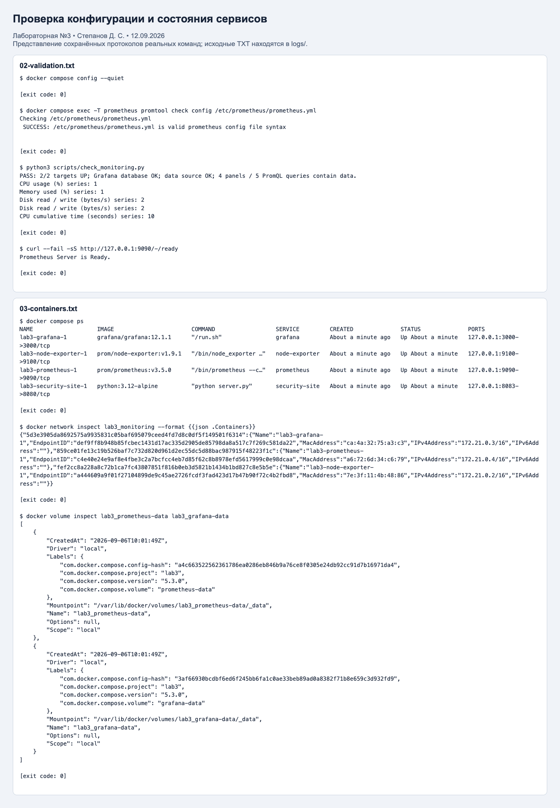

### 2.4. Состояние целей Prometheus

Открыта страница [Targets](http://127.0.0.1:9090/targets). Оба задания — `prometheus` и `node-exporter` — имеют статус UP. Дополнительно проверен `/api/v1/targets`: обе цели здоровы, ошибок последнего опроса нет. [Ответ API](logs/04-targets.json).

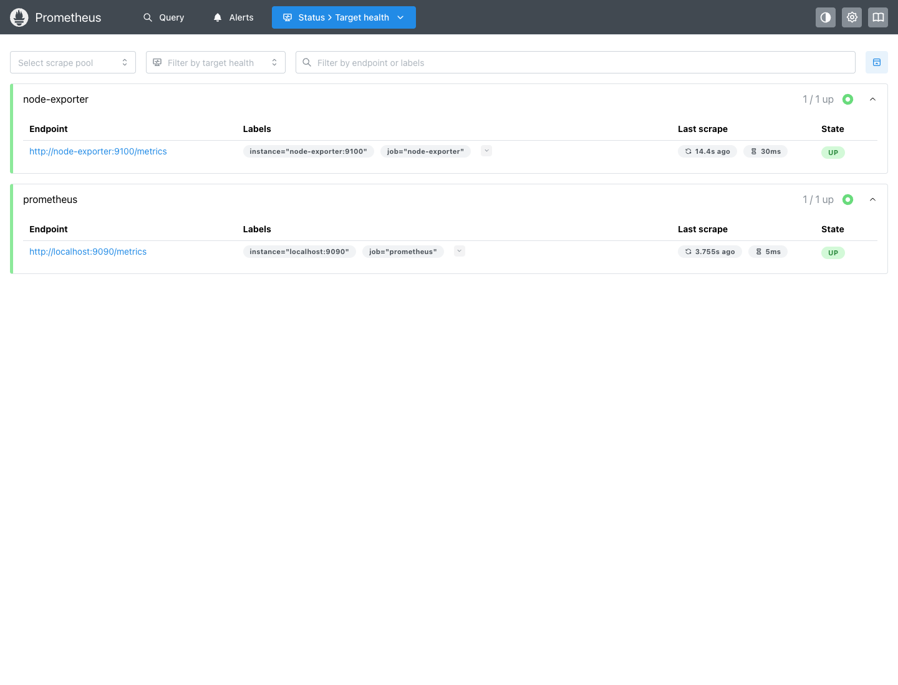

## 3. Источник данных и дашборд Grafana

Выполнен вход через браузер с учебными учётными данными `admin/admin`. Источник данных и дашборд созданы через provisioning — конфигурационные файлы автоматически загружаются при запуске Grafana. Это воспроизводимый эквивалент ручного добавления через интерфейс.

Параметры источника: имя `Prometheus`, тип `prometheus`, UID `prometheus`, URL `http://prometheus:9090`. Запросы выполняет сервер Grafana, поэтому используется имя контейнерного сервиса, а не браузерный localhost. [Конфигурация источника](grafana/provisioning/datasources/prometheus.yml).

Проверка `/api/datasources/uid/prometheus/health` с авторизацией вернула `status: OK` и успешный запрос к Prometheus. [Результат проверки соединения](logs/06-datasource-health.json). `/api/health` подтвердил работоспособность базы Grafana. [Ответ](logs/05-grafana-health.json).

Создан и сохранён дашборд **Lab 3 — System Monitoring**, папка `Lab3`, обновление 15 секунд, интервал просмотра 15 минут. [JSON дашборда](grafana/dashboards/lab3.json), [сохранённый объект через API](logs/07-dashboard.json).

### 3.1. Использованные запросы

**CPU usage (%):**

```promql
100 * (1 - avg by (instance) (
  rate(node_cpu_seconds_total{job="node-exporter",mode="idle"}[1m])
))
```

`node_cpu_seconds_total` — накопительный счётчик секунд CPU. Для загрузки сначала рассчитывается скорость роста времени простоя, затем доля простоя усредняется по ядрам и вычитается из 1. Результат отображается в процентах.

**Memory used (%):**

```promql
100 * (1 - node_memory_MemAvailable_bytes{job="node-exporter"}
  / node_memory_MemTotal_bytes{job="node-exporter"})
```

`MemAvailable` учитывает память, доступную приложениям, в том числе потенциально освобождаемый кеш; поэтому эта оценка информативнее простого использования `MemFree`.

**Disk read / write (bytes/s):**

```promql
rate(node_disk_read_bytes_total{
  job="node-exporter",device!~"loop.*|ram.*|nbd.*"
}[1m])
```

Вторая серия использует `node_disk_written_bytes_total` с теми же фильтрами. Показана скорость чтения и записи в байтах в секунду для `vda` и `vdb`. Учебный фильтр исключает loop, RAM и NBD устройства; диски другого Linux-хоста могут иметь другие имена. Панель показывает интенсивность I/O, а не процент заполнения диска.

**CPU cumulative time (seconds):**

```promql
node_cpu_seconds_total{job="node-exporter",mode="user"}
```

Это непосредственно требуемая заданием метрика, отфильтрованная по пользовательскому режиму. Для десяти CPU отображаются отдельные линии. Накопленное время нельзя трактовать как процент загрузки.

### 3.2. Результат проверки

Для четырёх панелей выполнены пять PromQL-запросов: CPU usage — 1 ряд, память — 1 ряд, чтение диска — 2 ряда, запись диска — 2 ряда, накопленное CPU-время — 10 рядов. Все запросы вернули непустые результаты. [Фактические значения и метки](logs/08-promql.json).

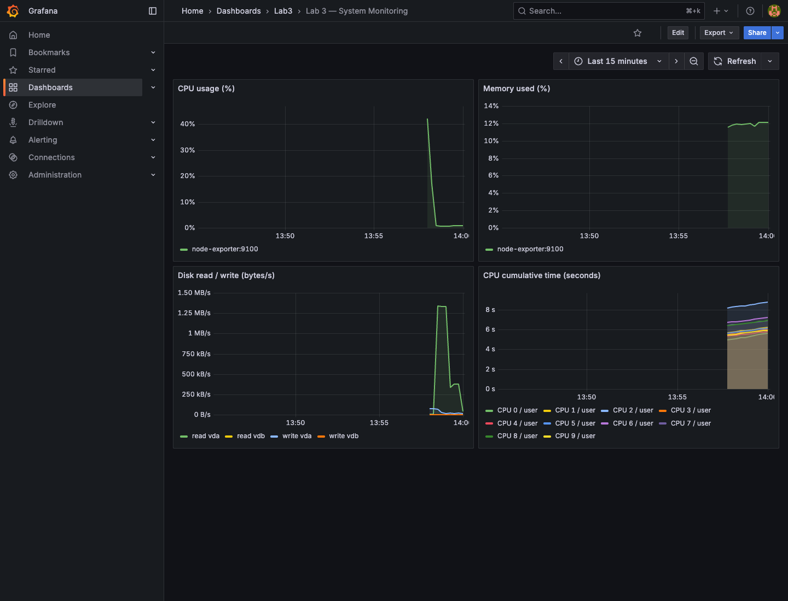

Промежуток слева без линий объясняется тем, что дашборд показывает 15 минут, а сбор данных был запущен недавно. Для `rate(...[1m])` нужны минимум две точки; сразу после старта следует дождаться нескольких опросов.

## 4. Подготовка проверки безопасности

Сайт написан на стандартной библиотеке Python; его [исходный код](security/site/server.py) и синтетические файлы включены в работу. Он доступен только локально. Уязвимый `/download` и исправленный `/safe-download` читают файл, заданный параметром `file`. Каталог публичных файлов — `/app/public`, тестовый закрытый файл — `/app/private/demo.txt`.

ffuf установлен из официального релиза 2.3.0 для macOS arm64, версия проверена командой `ffuf -V`. Альтернативная установка при наличии Go:

```sh
go install github.com/ffuf/ffuf/v2@v2.3.0
```

Подготовлены два небольших словаря: [common.txt](security/wordlists/common.txt), 12 записей, и [files.txt](security/wordlists/files.txt), 11 записей. Первый проверяет маршруты, второй — служебные файлы, расширения и административные пути. Это собственные учебные списки, не полные стандартные `common.txt` или `directory-list-2.3-medium.txt`; результат не является исчерпывающим поиском всех путей.

Перед перебором выполнен контрольный запрос к несуществующему адресу: HTTP 404, тело `Not found`, 9 байт. Во время сканирования оставлены коды 200, 301, 302, 403, поэтому такой ответ не попадает в находки. Фильтр по размеру `-fs 9` не использовался: он скрыл бы `/admin`, где тело `Forbidden` тоже имеет длину 9 байт.

## 5. Проверка Path Traversal

Для запросов применён `curl --path-as-is`, чтобы curl не убирал сегменты `../` до отправки. Полные запросы и ответы сохраняет [check_security.py](scripts/check_security.py).

Базовый адрес всех попыток: `http://127.0.0.1:8083`.

| № | Путь и параметры | HTTP | Результат |
|---|---|---:|---|
| 1 | `/../../../etc/passwd` | 404 | Утечка не обнаружена |
| 2 | `/..%2F..%2F..%2Fetc%2Fpasswd` | 404 | Утечка не обнаружена |
| 3 | `/....//....//....//etc/passwd` | 404 | Утечка не обнаружена |
| 4 | `/download?file=readme.txt` | 200 | Контроль: публичный файл доступен |
| 5 | `/download?file=../private/demo.txt` | 200 | Обход каталога подтверждён |
| 6 | `/download?file=%2e%2e%2fprivate%2fdemo.txt` | 200 | Обход с URL-кодированием подтверждён |
| 7 | `/download?file=%252e%252e%252fprivate%252fdemo.txt` | 404 | Двойное кодирование не сработало |
| 8 | `/safe-download?file=../private/demo.txt` | 403 | Исправленный обработчик блокирует выход |
| 9 | `/safe-download?file=%2e%2e%2fprivate%2fdemo.txt` | 403 | Кодированный выход также блокируется |
| 10 | `/safe-download?file=readme.txt` | 200 | Исправление сохраняет штатную загрузку |

Успешность установлена по содержимому ответа: в попытках 5 и 6 получен маркер `LAB3_PATH_TRAVERSAL_CONFIRMED` из закрытой тестовой папки. Один HTTP 200 сам по себе не доказывает уязвимость. Варианты 1–3 обращаются к маршрутам, которых в этом приложении нет; их неуспех не доказывает безопасность `/download`.


**Причина:** уязвимый обработчик соединяет базовый путь и ввод пользователя, затем читает файл без проверки результата нормализации. URL-декодирование превращает `%2e%2e%2f` в `../`. Двойное кодирование не сработало, потому что значение параметра декодируется один раз.

Исправленный обработчик сначала нормализует путь, затем проверяет принадлежность разрешённому каталогу:

```python
target = (ROOT / name).resolve()
if not target.is_relative_to(ROOT.resolve()):
    return self.reply(403, 'Forbidden: path outside public directory', 'text/plain')
```


Исправление демонстрирует проверку границ каталога в неизменяемом учебном файловом дереве. Для реального файлового сервиса предпочтительны разрешённые идентификаторы файлов, минимальные права процесса и защита от подмены ссылок между проверкой и чтением.

## 6. Перебор страниц через ffuf

Выполнены два запуска с одним потоком и ограничением 5 запросов в секунду:

```sh
ffuf -w security/wordlists/common.txt \
  -u http://127.0.0.1:8083/FUZZ -mc 200,301,302,403 \
  -t 1 -rate 5 -noninteractive -of json -o logs/ffuf-common.json

ffuf -w security/wordlists/files.txt \
  -u http://127.0.0.1:8083/FUZZ -mc 200,301,302,403 \
  -t 1 -rate 5 -noninteractive -of json -o logs/ffuf-files.json
```

`FUZZ` заменяется словом из списка. Найденные пути подтверждены чтением ответов. Перенаправления автоматически не обходились: `/uploads` отдельно обнаружен как 301, `/uploads/` проверен прямым запросом.

| Словарь | Найденный путь | HTTP | Интерпретация |
|---|---|---:|---|
| common | `/about` | 200 | Обычная страница |
| common | `/admin` | 403 | Путь существует, доступ запрещён; вход не получен |
| common | `/uploads` | 301 | Перенаправление на каталог со слешем |
| common | `/download` | 200 | Обработчик загрузки |
| common | `/safe-download` | 200 | Исправленный обработчик |
| common | `/robots.txt` | 200 | Указание `/admin`, не средство контроля доступа |
| files | `/.env` | 200 | Открытые синтетические настройки |
| files | `/backup.sql` | 200 | Доступная тестовая резервная копия |
| files | `/config.php.bak` | 200 | Раскрытие резервной копии конфигурации |
| files | `/uploads/` | 200 | Листинг каталога |
| files | `/uploads/demo.txt` | 200 | Доступный тестовый файл |

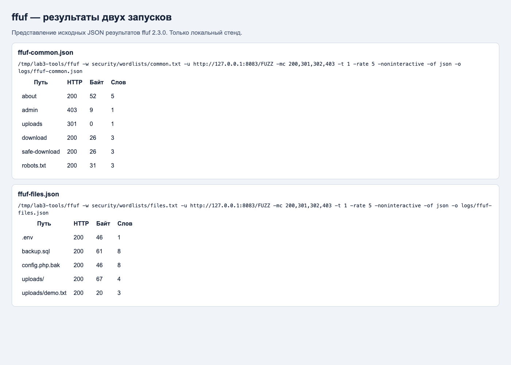

Протоколы: [первый запуск](logs/10-ffuf-common.txt), [второй запуск](logs/11-ffuf-files.txt), [JSON common](logs/ffuf-common.json), [JSON files](logs/ffuf-files.json). Всего 23 позиции словарей, 11 совпадений по кодам; это не 11 уязвимостей.

## 7. Дополнительные проверки и выводы о безопасности

| Проверка | Фактический результат | Оценка и рекомендация |
|---|---|---|
| `/.env` | 200, `APP_ENV=training`, демонстрационный токен | Ошибка публикации. Хранить конфигурацию вне web-root; реальных секретов в стенде нет |
| `/config.php` | 404 | Файл не обнаружен по этому пути |
| `/backup.sql` | 200, тестовая схема таблицы | Резервные копии не должны раздаваться веб-сервером |
| `/config.php.bak` | 200, учебный текст | Запретить публикацию резервных расширений и хранить копии вне публичного каталога |
| `/index.php.old`, `/site.backup` | 404 | Утечка по двум указанным путям не обнаружена |
| `/admin` | 403 | Доступ закрыт; обход авторизации не проверялся |
| `/wp-admin`, `/phpmyadmin` | 404 | Эти интерфейсы не обнаружены |
| `/uploads/` | 200, `Index of /uploads/` | Листинг раскрывает имя `demo.txt`; отключить листинг и проверять права на файлы |
| HTTP-заголовки `/` | `Server: LabTraining/1.0`, нет CSP и X-Content-Type-Options | Раскрыта версия учебного сервера; убрать избыточные сведения, настроить защитные заголовки |

Отсутствие заголовков не доказывает XSS и не означает, что приложение с ними автоматически безопасно. HSTS на HTTP-стенде localhost не оценивался; TLS в этой работе не настраивался. Все положительные находки намеренно заложены в учебное приложение.

После нормализации и проверки границы каталога две проверенные формы обхода блокируются, а обычная загрузка работает. Уязвимый маршрут оставлен в стенде для демонстрации сравнения. Наличие 404 и 403 по некоторым путям не позволяет объявить безопасным весь сайт.

## 8. Страницы учебного сайта: скриншоты и объяснение проверок

В этом разделе показаны **настоящие страницы локального сайта в браузере**. Это отдельные снимки страниц, а не изображения протоколов curl из следующего раздела. Сайт намеренно минимальный: заголовки, ссылки и текстовые ответы. Отсутствие оформления не является ошибкой загрузки.

Все адреса относятся к учебному стенду `http://127.0.0.1:8083`. HTTP-коды ниже зафиксированы по ответам браузеру в [протоколе снятия скриншотов](logs/site-browser-captures.json); сам снимок содержимого страницы не показывает сетевой статус. Тестовые данные созданы специально для лабораторной и не являются чужими паролями или базами данных.

### 8.1. Главная страница: какой сайт проверяется

Адрес: `http://127.0.0.1:8083/`. Ответ: **200 OK**.

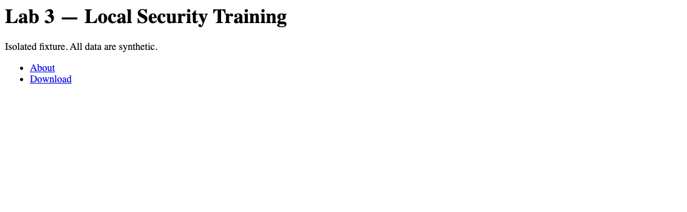

На экране название стенда, пояснение о синтетических данных и ссылки About и Download. Проверка подтверждает, что приложение запущено и отвечает. Это контрольный запрос, а не поиск уязвимости.

### 8.2. Обычная загрузка файла: контроль перед обходом пути

Адрес: `http://127.0.0.1:8083/download?file=readme.txt`. Ответ: **200 OK**.


На странице текст `Public training document.` — содержимое разрешённого файла из `/app/public`. Параметр `file` сообщает серверу, какой файл открыть. Этот запрос нужен для сравнения: сначала проверяется штатная функция, затем в тот же параметр подставляется другой путь.

**Что означают два скриншота в разделе 5:** при `file=../private/demo.txt` сегмент `../` означает «подняться на папку выше». Уязвимый `/download` выходит из `/app/public` и показывает маркер из `/app/private/demo.txt`. Это подтверждённый Path Traversal — чтение за пределами разрешённой папки. Исправленный `/safe-download` на тот же ввод показывает `Forbidden: path outside public directory` и возвращает 403. Проверяется возможность прочитать файл, а не подобрать пароль.

### 8.3. Открытый .env: раскрытие настроек

Адрес: `http://127.0.0.1:8083/.env`. Ответ: **200 OK**.


Видны `APP_ENV=training` и `DEMO_TOKEN=NOT_A_REAL_SECRET`. Проверяется, отдаёт ли сайт настройки любому посетителю по прямому URL. На реальном проекте такой файл может содержать конфиденциальные значения; здесь строка специально обозначает ненастоящий секрет. Результат показывает ошибку публикации служебного содержимого. Для проверки не требовалось входить в аккаунт.

### 8.4. backup.sql: доступная резервная копия

Адрес: `http://127.0.0.1:8083/backup.sql`. Ответ: **200 OK**.

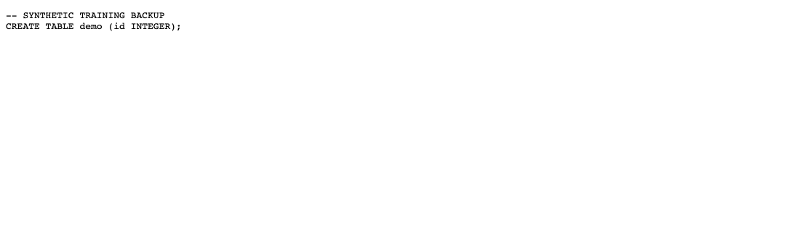

Показаны комментарий `SYNTHETIC TRAINING BACKUP` и команда создания таблицы `demo`. Проверка выясняет, доступна ли резервная копия через веб-сервер. SQL здесь **не выполняется**: браузер получает текст. Это проверка раскрытия файла, а не SQL-инъекция. Реальных записей пользователей в примере нет.

### 8.5. config.php.bak: забытая копия конфигурации

Адрес: `http://127.0.0.1:8083/config.php.bak`. Ответ: **200 OK**.

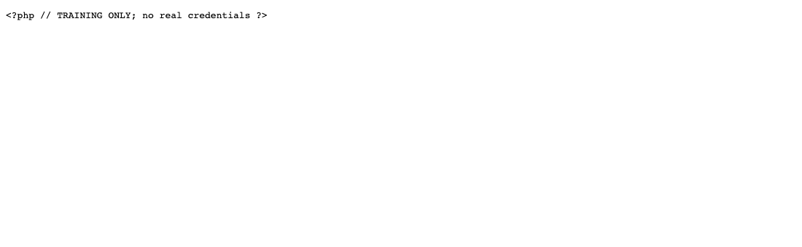

На странице исходный текст с пометкой `TRAINING ONLY; no real credentials`. Проверяется типичная ошибка: основная конфигурация может быть недоступна, но её копия с расширением `.bak` осталась публичной. В стенде `/config.php` возвращает 404, а `/config.php.bak` — 200. PHP-код не исполнялся; ответ сформирован учебным Python-сервером.

### 8.6. uploads/: листинг каталога

Адрес: `http://127.0.0.1:8083/uploads/`. Ответ: **200 OK**.

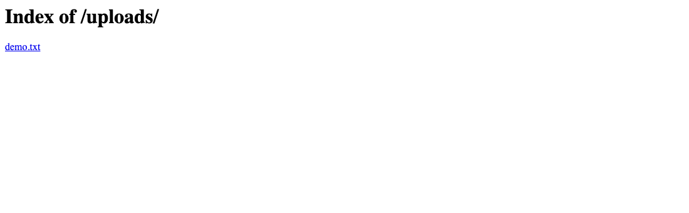

Виден заголовок `Index of /uploads/` и ссылка `demo.txt`. Проверяется, раскрывает ли сайт список файлов посетителю, который знает только адрес каталога. На стенде листинг воспроизведён отдельным обработчиком Python, а не включением autoindex в nginx. Это демонстрация того же наблюдаемого поведения: сайт сообщает имена файлов. Сам по себе публичный список не всегда является уязвимостью; ошибка возникает, если эти имена и файлы не должны быть доступны.

### 8.7. admin: найденный адрес с запрещённым доступом

Адрес: `http://127.0.0.1:8083/admin`. Ответ: **403 Forbidden**.


Слово `Forbidden` означает, что этот запрос отклонён. ffuf показывает адрес в результатах, потому что при запуске явно выбраны в том числе ответы 403. **Административная панель не взломана, доступ к ней не получен.** Более того, в учебном приложении здесь только обработчик с отказом, полноценной панели нет. Подбора паролей и обхода авторизации не проводилось.

### 8.8. config.php: отрицательный результат

Адрес: `http://127.0.0.1:8083/config.php`. Ответ: **404 Not Found**.


`Not found` означает, что по этому адресу содержимое не найдено. Это отрицательная проверка одного пути, а не доказательство безопасности сайта целиком. Такой ответ не попадает в выбранные результаты ffuf, поскольку фильтр оставляет 200, 301, 302 и 403.

### 8.9. robots.txt: подсказка о маршруте

Адрес: `http://127.0.0.1:8083/robots.txt`. Ответ: **200 OK**.


Строка `Disallow: /admin` просит поисковых роботов не обходить этот путь. Она не запрещает человеку отправить запрос и не заменяет авторизацию. Проверка показывает, что служебный файл может подсказать адрес, которого нет в меню. В данном стенде прямой запрос к `/admin` всё равно получает 403.

### 8.10. Как связаны скриншоты и инструменты

1. **Браузерные снимки** показывают, какое содержимое увидел посетитель сайта.
2. **curl** сохраняет точный запрос, код, заголовки и тело ответа. Он использован для 22 проверок, включая кодированные варианты Path Traversal. В браузере часть путей может нормализоваться ещё до отправки, поэтому для этих запросов использован `curl --path-as-is`.
3. **ffuf** автоматически подставляет слова из двух списков вместо `FUZZ`. Он помогает найти адреса, после чего их содержимое проверяется отдельно. Найденный адрес не обязательно является уязвимостью.
4. **Скриншоты Prometheus и Grafana** относятся к другой части лабораторной: подтверждают сбор и отображение метрик CPU, памяти и диска. Проверок безопасности они не выполняют.

Коды ответов: **200** — сервер успешно обработал запрос; **301** — перенаправил на другой адрес; **403** — запретил доступ; **404** — не нашёл содержимое по адресу. Вывод об утечке делается по тому, *что именно* вернул сервер, а не по одному коду.

## 9. Скриншоты всех HTTP-проверок

Ниже — снимки браузерного представления сохранённых протоколов curl, а не имитация терминала. Они содержат реальные команды, HTTP-статусы, заголовки и тела ответов. Оригинальные TXT сохранены в `logs/security-*.txt`, сводка — [security-summary.json](logs/security-summary.json). HTML-представления находятся в [logs/evidence](logs/evidence/).

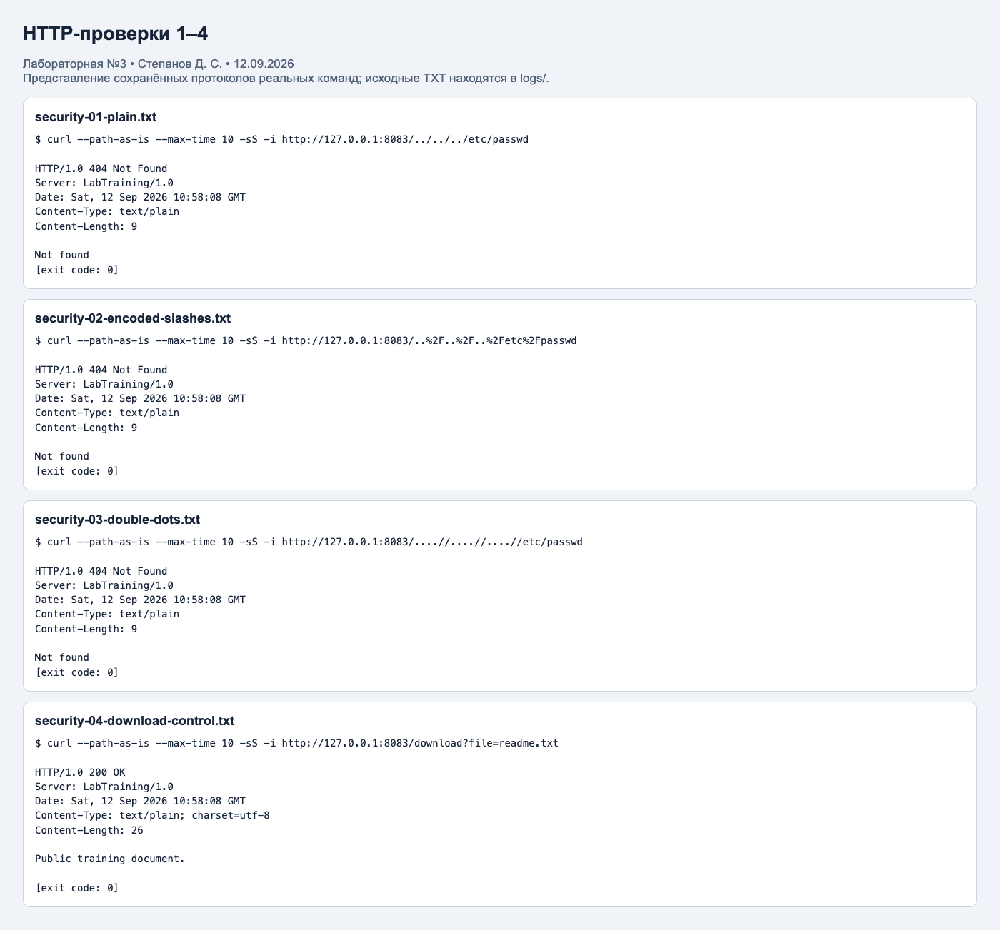

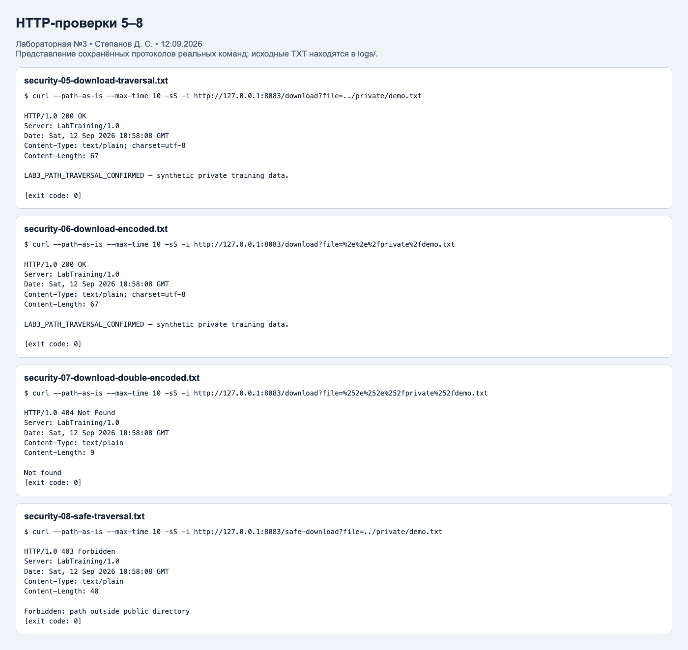

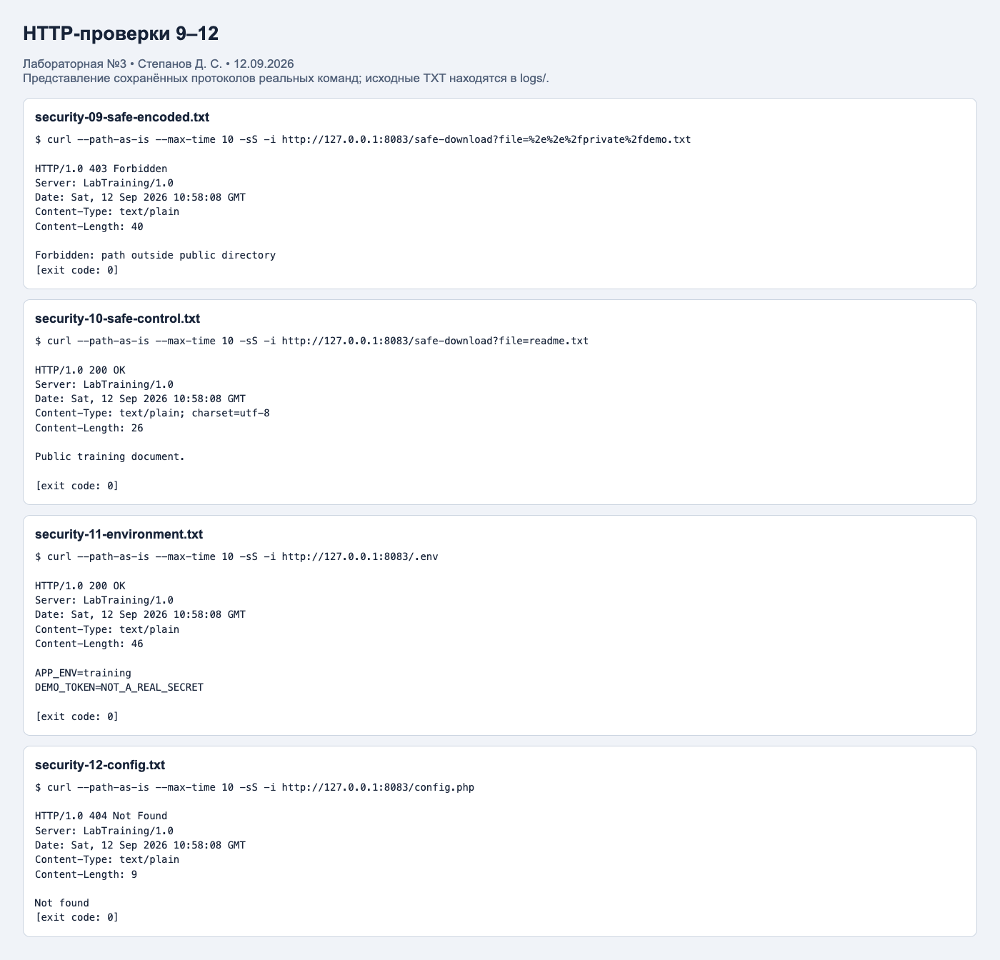

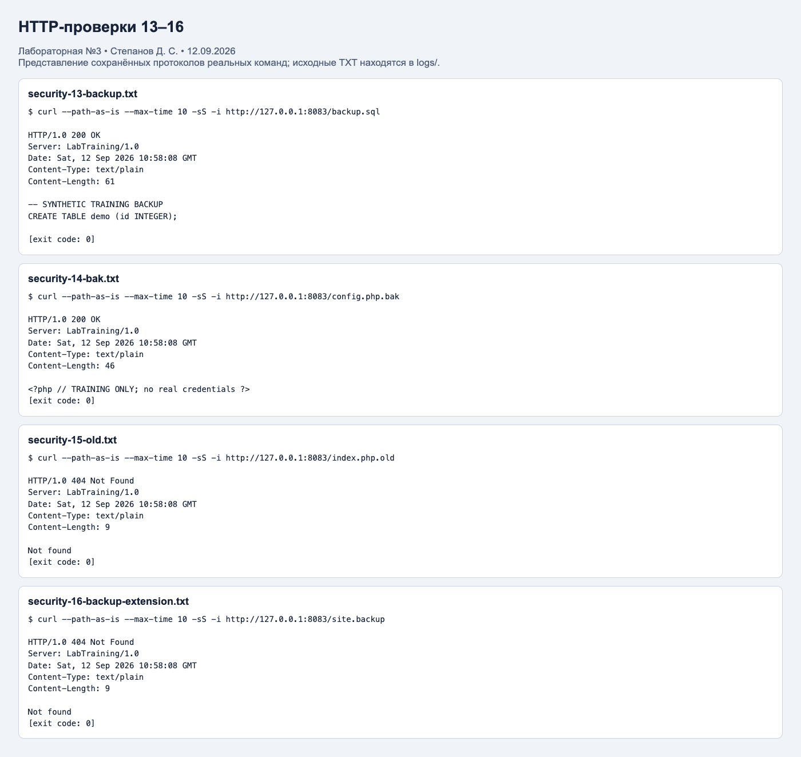

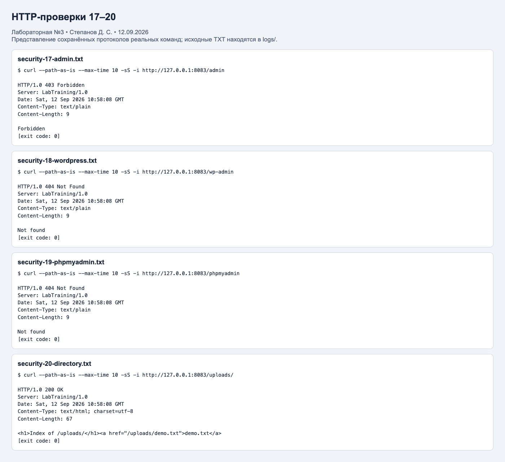

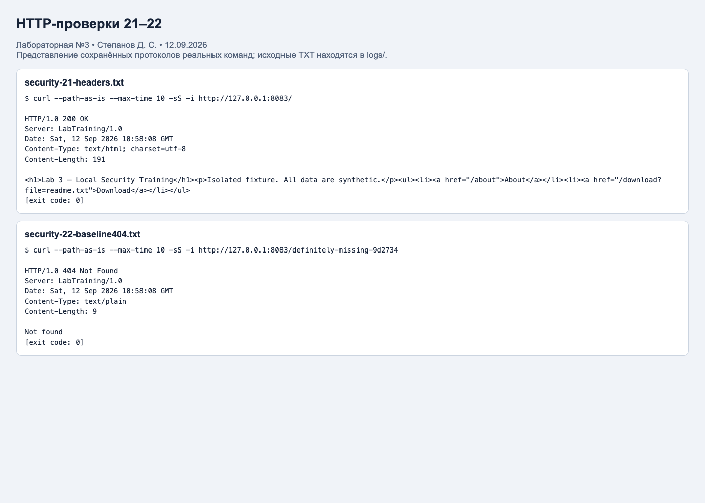

## 10. Повторный запуск и демонстрация

Требуются Docker с Compose, Python 3 для проверок и ffuf для перебора. В терминале открыть папку `lab3`:

```sh
docker compose up -d
# Дождаться 2–3 опросов Prometheus, примерно 45 секунд.
python3 scripts/check_monitoring.py
python3 scripts/check_security.py
sh scripts/run_ffuf.sh
```

Если ffuf установлен вне PATH, указать путь: `FFUF_BIN=/путь/к/ffuf sh scripts/run_ffuf.sh`. Скрипты проверок перезаписывают соответствующие JSON и HTTP-протоколы; скриншоты фиксируют первоначальное выполнение 12.09.2026.

Открыть [Prometheus Targets](http://127.0.0.1:9090/targets) и [дашборд Grafana](http://127.0.0.1:3000/d/lab3-monitoring). Учебный вход Grafana: `admin/admin`. При первом входе Grafana предлагает сменить пароль; для воспроизведения проверок с этими учётными данными можно выбрать Skip. Сервисы доступны только с локального компьютера.

Остановка с сохранением данных: `docker compose down`. Не добавлять `-v`, если нужно сохранить историю метрик и настройки Grafana. Для просмотра ошибок: `docker compose logs prometheus node-exporter grafana`.

## Вывод

Настроена и фактически проверена локальная система мониторинга: Node Exporter отдаёт системные метрики, Prometheus собирает их каждые 15 секунд, обе цели имеют статус UP, Grafana отображает четыре панели. Проверены пять PromQL-запросов, сеть и постоянные тома.

На изолированном учебном сайте выполнены 22 HTTP-проверки и два запуска ffuf. Подтверждены обход каталога в двух формах, публикация тестовых конфигураций и резервных копий, а также листинг каталога. Исправленный обработчик блокирует обе проверенные формы обхода без нарушения обычной загрузки. Освоены различия между обнаруженным адресом и подтверждённой уязвимостью, между счётчиком и скоростью его изменения, а также ограничения выводов по небольшому набору проверок.

## Источники

1. [Правила оформления отчётов курса](https://ex-itmo-ict-faculty.github.io/introduction-in-web-tech/education/labs2025-2026/reportdesign/).
2. [Prometheus: конфигурация](https://prometheus.io/docs/prometheus/latest/configuration/configuration/).
3. [Prometheus: функции PromQL](https://prometheus.io/docs/prometheus/latest/querying/functions/).
4. [Node Exporter: запуск и особенности контейнеризации](https://github.com/prometheus/node_exporter).
5. [Grafana: provisioning источников и дашбордов](https://grafana.com/docs/grafana/latest/administration/provisioning/).
6. [Docker Compose](https://docs.docker.com/compose/).
7. [ffuf: официальный проект и релизы](https://github.com/ffuf/ffuf).
